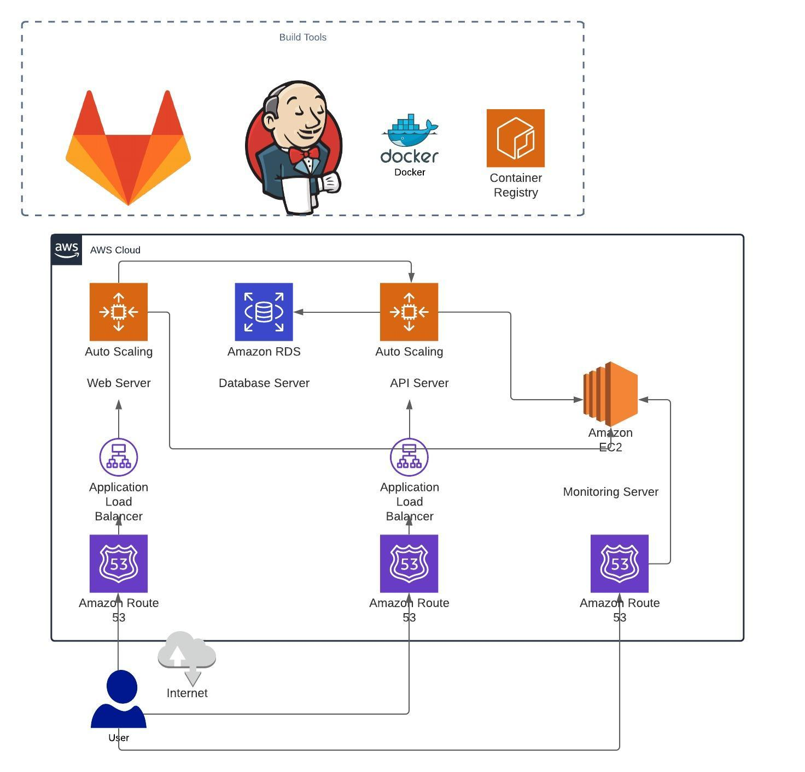

1. Architecture Diagram:
   
- 

2. Build

The Web and Api components of the application is built using a Nodejs docker image and is exposed on port 8082 and 8083 respectively.

3. Infrastructure

The Infrastructure for the application is built on AWS.

The Web component and the API component of the application are deployed on seperate infrastructures to provide highly available and fault tolerent system.

The Database component is built on AWS RDS which provides secure and managed infrastructure.

4. Storage and backups

The storage system for RDS is backed up everyday and the storage retention policy is configurable.

5. Logging

Logging is managed within the monitoring cluster with the application logs from Web and Api stack being redirected to ELK stack running on the monitoring server.

6. Monitoring

System monitoring is enabled for all the nodes on Prometheus. Node exporters are installed on each nodes and are pulled by the prometheus agent running on the monitoring server. For visualization purposes, Grafana is installed as well.

| Application  | Port     | Stack      | Load Balanced? |     
| :---         | :---:    | :---:      |  :---:         |
| API          | 8082     | api        |   Yes          |
| Web          | 8083     | web        |   Yes          |
| Database     | 5432     | db         |   No           |
| Elasticsearch| 9200     | monitoring |   No           |
| Logstash     | 5044     | monitoring |   No           |
| Kibana       | 5601     | monitoring |   No           |
| Grafana      | 3000     | monitoring |   No           | 
| Prometheus   | 9000     | monitoring |   No           | 
| Node Exporter| 9100     | api and web|   No           | 

## Stack Features

1. Zero downtime deployment.
2. Weighted load balancing to support canary release.
3. Monitoring and logging across all stacks.
4. High availablilty stacks.
5. Multi environment deployment capability.